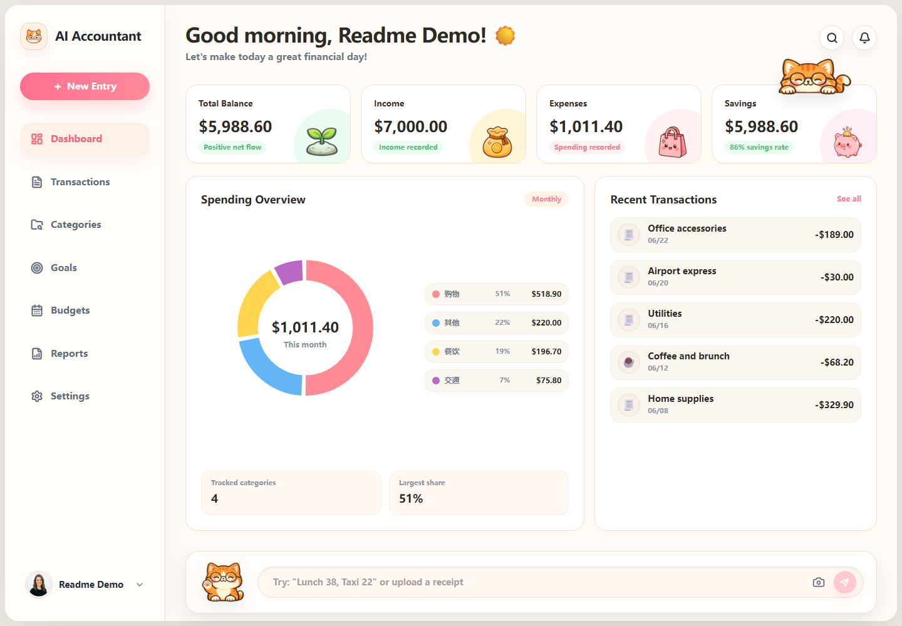
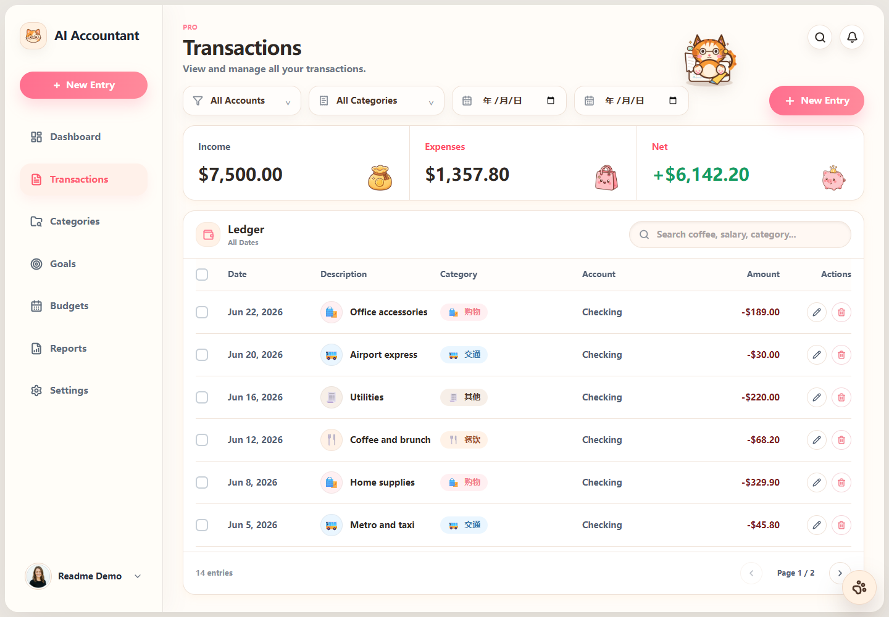
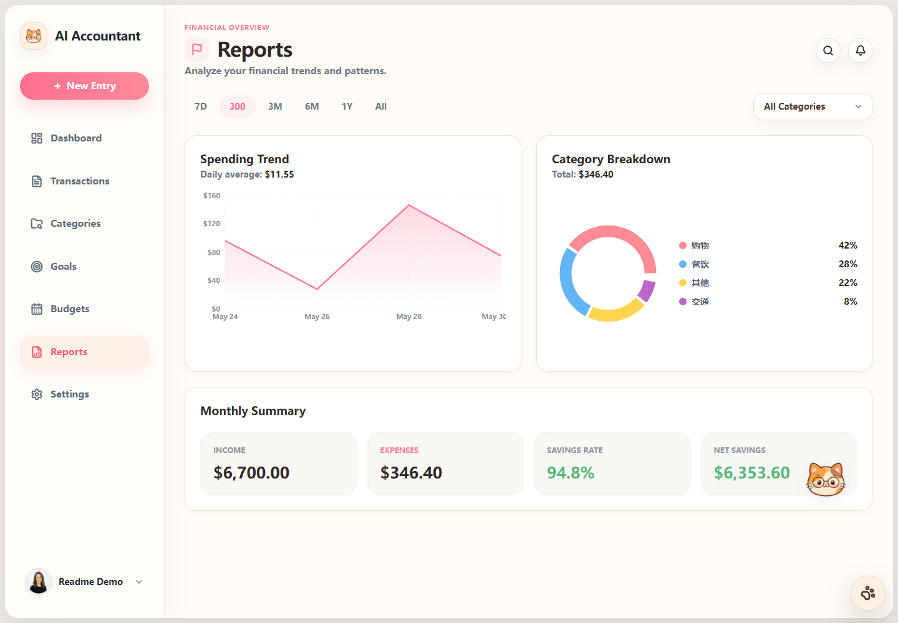
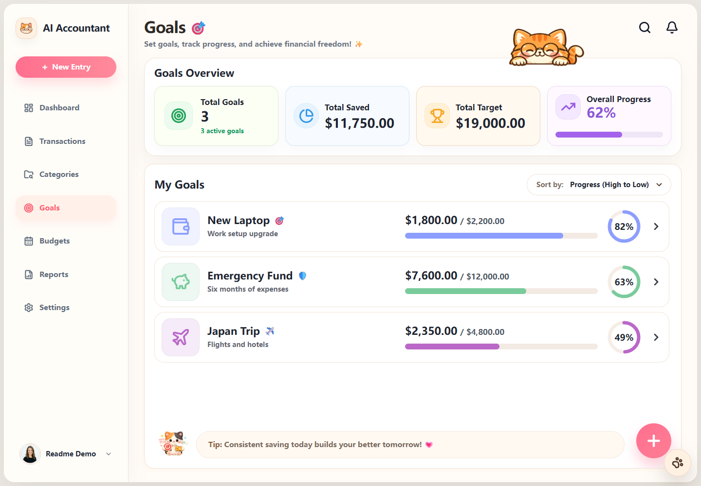
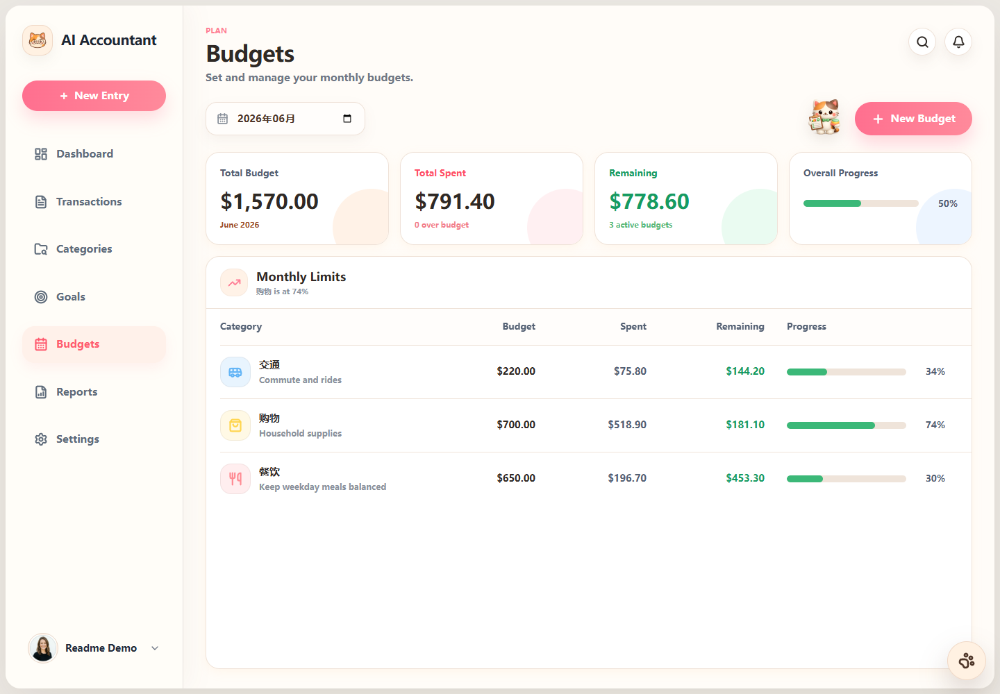

# AI Accountant

AI Accountant 是一个面向个人记账场景的全栈应用。它提供交易流水、分类、预算、储蓄目标、仪表盘报表和 AI 辅助记账能力，适合用于学习、二次开发或自托管个人财务工具。

[](./LICENSE)
[](https://github.com/Tjy5/ai-accountant/actions/workflows/ci.yml)
[](./backend)
[](./frontend)

## 界面预览

| Dashboard | Transactions |
| --- | --- |
|  |  |

| Reports | Goals |
| --- | --- |
|  |  |

| Budgets |
| --- |
|  |

## 功能特性

- **账户与认证：** 基于 JWT Bearer Token 的注册、登录和用户态接口访问。
- **AI 辅助记账：** 支持文本和图片识别记账草稿，并将确认后的草稿写入交易流水。
- **交易管理：** 支持收入、支出、分类、日期、描述等字段的增删改查与筛选。
- **分类管理：** 为每个用户维护独立分类，注册时自动初始化默认分类。
- **预算与目标：** 支持月度预算、储蓄目标和完成进度管理。
- **仪表盘与报表：** 提供汇总数据、图表数据、月度趋势和预算健康度视图。
- **AI Provider 设置：** 支持全局 AI 配置，也支持用户在设置页保存个人 API Key 和模型配置。
- **本地优先开发：** 默认使用 H2 文件数据库，无需额外数据库即可启动；生产类环境可切换 MySQL。

## 技术栈

| 模块 | 技术 |
| --- | --- |
| 后端 | Java 17、Spring Boot 3.3、Spring Security、MyBatis Plus、H2、MySQL、JJWT |
| 前端 | React 19、TypeScript、Vite、React Router、Zustand、Axios、Recharts、Vitest |
| AI 接入 | OpenAI Chat Completions 兼容接口 |
| 测试 | Maven Test、Spring Boot Test、Vitest、Testing Library |

## 目录结构

```text
.
├── backend/              # Spring Boot API 服务
├── docs/screenshots/     # README 界面预览截图
├── frontend/             # React + Vite 前端应用
├── LICENSE               # MIT 许可证
├── README.md             # 项目总览与快速开始
├── CONTRIBUTING.md       # 贡献指南
├── SECURITY.md           # 安全策略
└── CHANGELOG.md          # 变更记录
```

## 快速开始

### 环境要求

- Java 17 或更高版本
- Node.js 20 或更高版本
- npm 10 或更高版本
- 可选：MySQL 8.x（默认本地开发不需要）

### 1. 克隆仓库

```bash
git clone https://github.com/Tjy5/ai-accountant.git
cd ai-accountant
```

### 2. 配置后端环境变量

后端默认可以直接使用 H2 文件数据库启动。需要启用 AI 识别时，请先配置 API Key。

```bash
cd backend
cp .env.example .env
```

`backend/.env.example` 是环境变量样例。Spring Boot 默认不会自动读取 `.env` 文件，请在终端、IDE Run Configuration、系统环境变量或部署平台中设置这些变量。

Windows PowerShell:

```powershell
$env:JWT_SECRET = "replace-with-at-least-32-random-characters"
$env:AI_API_KEY = "replace-with-your-provider-api-key"
$env:AI_ENCRYPTION_KEY = "replace-with-base64-encoded-16-24-or-32-byte-key"
```

macOS/Linux:

```bash
export JWT_SECRET="replace-with-at-least-32-random-characters"
export AI_API_KEY="replace-with-your-provider-api-key"
export AI_ENCRYPTION_KEY="replace-with-base64-encoded-16-24-or-32-byte-key"
```

`AI_ENCRYPTION_KEY` 用于加密用户在设置页保存的个人 AI API Key。可以用下面的命令生成一个 256-bit AES Key：

```bash
openssl rand -base64 32
```

### 3. 启动后端

Windows PowerShell:

```powershell
cd backend
.\mvnw.cmd spring-boot:run
```

macOS/Linux:

```bash
cd backend
./mvnw spring-boot:run
```

默认后端地址为 `http://127.0.0.1:3002`，健康检查接口为：

```bash
curl http://127.0.0.1:3002/api/health
```

### 4. 启动前端

```bash
cd frontend
cp .env.example .env
npm install
npm run dev
```

Vite 默认会把 `/api` 代理到 `http://127.0.0.1:3002`。浏览器打开终端输出的本地地址即可使用应用。

## 环境变量

### 后端

| 变量 | 默认值 | 说明 |
| --- | --- | --- |
| `SERVER_PORT` | `3002` | 后端服务端口。 |
| `DATABASE_URL` | H2 文件数据库 | JDBC 连接地址。 |
| `DATABASE_USER` | `sa` | 数据库用户名。 |
| `DATABASE_PASSWORD` | 空 | 数据库密码。 |
| `JWT_SECRET` | 开发用 fallback | JWT 签名密钥。生产环境必须设置强随机值。 |
| `JWT_EXPIRES_IN` | `30d` | JWT 过期时间。 |
| `CORS_ALLOWED_ORIGINS` | 本地开发地址 | 允许跨域访问的前端源，多个值用英文逗号分隔。 |
| `AI_ENABLED` | `true` | 是否启用 AI 功能。 |
| `AI_API_KEY` | 空 | 全局 AI Provider API Key。 |
| `AI_BASE_URL` | `https://api.openai.com/v1` | OpenAI 兼容接口 Base URL。 |
| `AI_MODEL` | `gpt-4o-mini` | 默认 AI 模型。 |
| `AI_JSON_MODE` | `auto` | JSON 响应模式：`auto`、`strict`、`json_object`、`prompt_only`。 |
| `AI_BASE_URL_ALLOWLIST` | 空 | 可选的 Base URL 主机白名单，多个值用英文逗号分隔。 |
| `AI_ENCRYPTION_KEY` | 空 | Base64 编码的 AES-128/192/256 密钥，用于加密用户个人 API Key。 |
| `AI_REQUEST_TIMEOUT_SECONDS` | `25` | AI 请求超时时间。 |
| `AI_MAX_OUTPUT_TOKENS` | `1200` | AI 输出 Token 上限。 |
| `AI_TEMPERATURE` | `0` | AI 采样温度。 |

### 前端

| 变量 | 默认值 | 说明 |
| --- | --- | --- |
| `VITE_API_PROXY_TARGET` | `http://127.0.0.1:3002` | Vite 开发服务器的后端代理目标。 |

## 使用 MySQL

默认本地开发使用 H2 文件数据库，数据文件位于 `backend/data/`。如果要使用 MySQL，请先创建数据库并导入 `backend/src/main/resources/db/mysql/schema.sql`。

```sql
CREATE DATABASE ai_accountant CHARACTER SET utf8mb4 COLLATE utf8mb4_0900_ai_ci;
CREATE USER 'ai_accountant'@'%' IDENTIFIED BY 'change-me';
GRANT ALL PRIVILEGES ON ai_accountant.* TO 'ai_accountant'@'%';
FLUSH PRIVILEGES;
```

Windows PowerShell:

```powershell
$env:MYSQL_URL = "jdbc:mysql://localhost:3306/ai_accountant?useUnicode=true&characterEncoding=utf8&serverTimezone=Asia/Shanghai&useSSL=false&allowPublicKeyRetrieval=true"
$env:MYSQL_USER = "ai_accountant"
$env:MYSQL_PASSWORD = "change-me"
cd backend
.\mvnw.cmd spring-boot:run -Dspring-boot.run.profiles=mysql
```

macOS/Linux:

```bash
export MYSQL_URL="jdbc:mysql://localhost:3306/ai_accountant?useUnicode=true&characterEncoding=utf8&serverTimezone=Asia/Shanghai&useSSL=false&allowPublicKeyRetrieval=true"
export MYSQL_USER="ai_accountant"
export MYSQL_PASSWORD="change-me"
cd backend
./mvnw spring-boot:run -Dspring-boot.run.profiles=mysql
```

## 常用命令

### 后端

```bash
cd backend
./mvnw test
./mvnw spring-boot:run
```

Windows 使用 `mvnw.cmd`：

```powershell
cd backend
.\mvnw.cmd test
.\mvnw.cmd spring-boot:run
```

### 前端

```bash
cd frontend
npm install
npm run dev
npm run lint
npm test
npm run build
```

## API 概览

主要 API 均以 `/api` 开头：

- `POST /api/auth/register`
- `POST /api/auth/login`
- `GET /api/auth/me`
- `POST /api/ai/analyze`
- `POST /api/ai/analyze-image`
- `POST /api/ai/transactions/commit`
- `GET|POST|PATCH|DELETE /api/transactions`
- `GET|POST|PATCH|DELETE /api/categories`
- `GET|POST|PATCH|DELETE /api/budgets`
- `GET|POST|PATCH|DELETE /api/goals`
- `GET /api/dashboard/summary`
- `GET /api/dashboard/charts`
- `GET /api/reports`
- `GET|PATCH /api/settings`
- `GET|PATCH /api/settings/ai`
- `POST /api/settings/ai/test`

更详细的后端说明请查看 [backend/README.md](./backend/README.md)，前端说明请查看 [frontend/README.md](./frontend/README.md)。

## 安全说明

- 不要提交 `.env`、数据库文件、日志或任何真实 API Key。
- 生产环境必须设置强随机 `JWT_SECRET`。
- 如果允许用户保存个人 AI API Key，建议设置 `AI_ENCRYPTION_KEY`。
- 如果开放自定义 AI Base URL，建议设置 `AI_BASE_URL_ALLOWLIST`。
- 当前项目适合自托管和学习使用，上线公网前请根据部署环境补充限流、审计、备份、HTTPS、日志脱敏和监控。

安全问题请不要公开提交 Issue，处理方式见 [SECURITY.md](./SECURITY.md)。

## 贡献

欢迎提交 Issue 和 Pull Request。开始贡献前请阅读 [CONTRIBUTING.md](./CONTRIBUTING.md) 和 [CODE_OF_CONDUCT.md](./CODE_OF_CONDUCT.md)。

## 许可证

本项目基于 [MIT License](./LICENSE) 开源。
