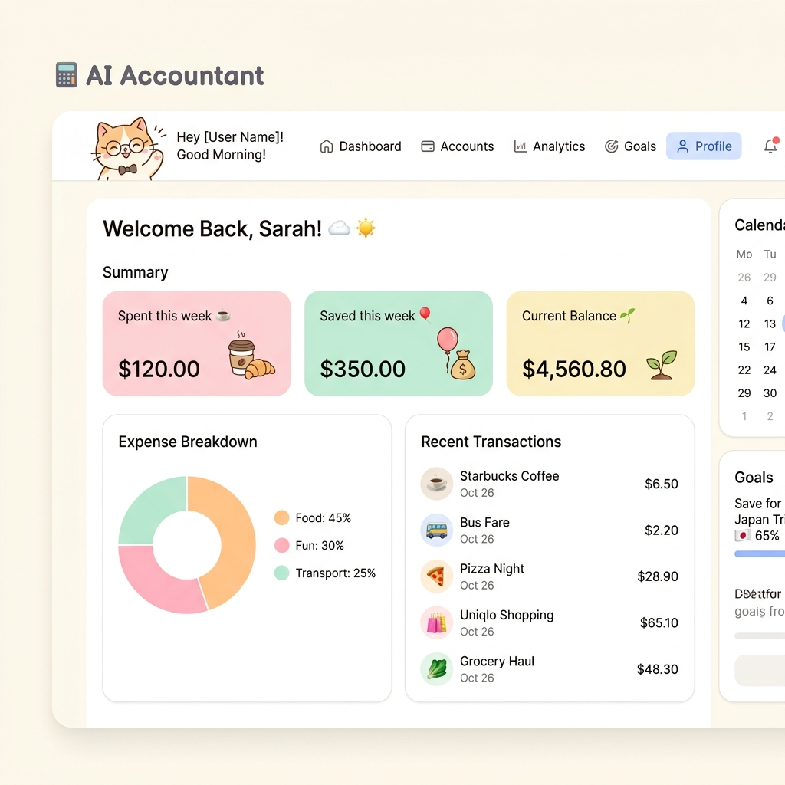
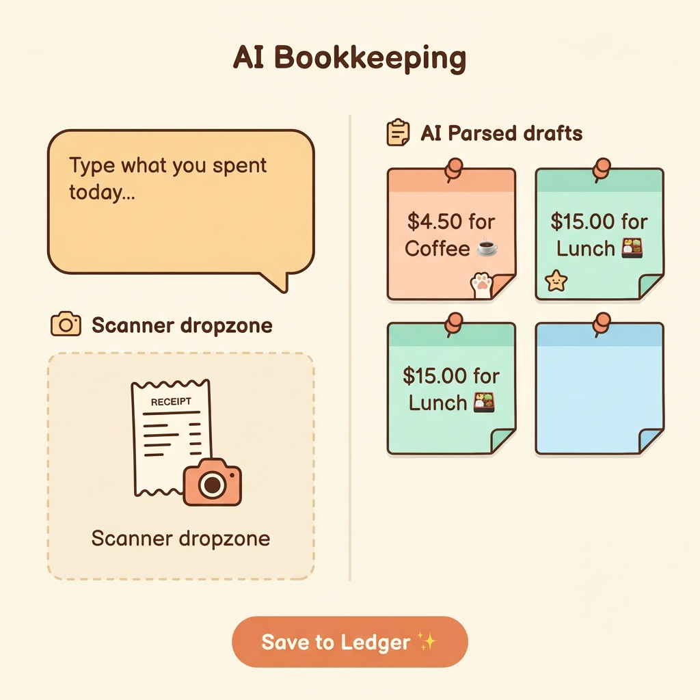

# AI Accountant 前端界面设计提案 (新版)

根据您的反馈，前一版暗黑科技风设计“不够可爱且 AI 感过强”。为此，我们重新设计了一套**治愈系日韩简约可爱风 (Cute & Cozy Minimalist - Light Mode)** 的界面。这套设计采用温暖的奶油色背景、柔和的马卡龙色卡片、手绘插画风格的猫咪记账助手，使整个财务管理应用变得轻松、亲切且充满温度。

以下为您展示这套**可爱风（主推）**与**科技风（备选）**的原型图及开发对接说明。

---

# 🎨 风格 A：治愈系日式可爱风 (主推)

这套设计选用奶油白（#FAF8F5）、暖沙色、淡粉和浅薄荷绿，搭配圆角矩形（border-radius: 20px+）、平面 2D 矢量插画和萌系表情，削弱了冷冰冰的数据感。

## 1. 登录与注册页面 (Cute Login)

温暖的背景上，一只戴着眼镜的毛茸茸白色小猫正在拨弄小计算器，输入框配有可爱的表情图标，搭配圆润明亮的“Let's Go! 🐾”按钮。


## 2. 仪表盘主页 (Cute Dashboard)

奶油色面板上方有挥手致意的猫咪管家，核心指标卡片使用粉色与薄荷绿圆角卡片，报表使用柔和圆润的马卡龙色饼图，交易列表自带 Emoji，充满手帐风格。



## 3. AI 智能记账页面 (Cute AI Bookkeeping)

左侧是圆润对话框样式的文本记账区和卡通相机收据扫描区，右侧 parsed 出来的记账草稿以可爱的“彩色便利贴/手帐贴纸”形式排列在白板上，打勾确认按钮为小猫爪印，极具趣味性。



---

# 💻 风格 B：现代科技暗黑风 (备选)

如果您未来需要更酷炫、更具数字化质感的界面，可以参考之前的科技风方案：

````carousel

<!-- slide -->

<!-- slide -->

````

---

## 📌 后端 API 映射说明 (前后端对接)

无论选择哪套视觉风格，底层的 Spring Boot 后端 API 对接逻辑完全一致：
1. **用户认证**：
   - 登录：`POST /api/auth/login`
   - 注册：`POST /api/auth/register`
   - 当前用户：`GET /api/auth/me`
2. **仪表盘渲染**：
   - 汇总数据：`GET /api/dashboard/summary`（返回总支出、总收入、净资产）
   - 图表统计：`GET /api/dashboard/charts`（返回收支分类和每日趋势）
3. **AI 智能记账**：
   - 文本解析：`POST /api/ai/analyze`（自然语言转记账草稿）
   - 图片解析：`POST /api/ai/analyze-image`（收据/小票 OCR 转记账草稿）
   - 草稿确认入账：`POST /api/ai/transactions/commit`（批量提交选中的草稿）

---

## 💡 给 AI 辅助前端开发的 Cute 风格 Prompt

如果您希望 AI 生成这种治愈系的日韩简约风前端代码，可以提供以下提示词：

```text
请根据我上传的这三张治愈系日韩简约可爱风的原型图，为我的个人财务应用 'AI Accountant' 编写前端代码 [React + Tailwind CSS / Vue 3]。

设计规范与要求：
1. 【整体风格】：温暖治愈的日式/韩式手帐风格（Cozy & Cute Minimalist）。
2. 【配色】：背景色使用柔和的奶油白 (#FAF8F5)，卡片和标签使用马卡龙粉、淡薄荷绿、暖橙和浅黄。
3. 【圆角与阴影】：卡片采用圆角设计（border-radius: 20px 或更大），并带有轻微且温暖的漫反射投影（shadow-sm/md，带一点暖调）。
4. 【版式与字体】：文字使用 rounded 无衬线字体（如 Nunito 或 Quicksand），字距排版松弛有度。
5. 【萌系元素】：
   - 登录框和仪表盘上部需要留出放置“可爱戴眼镜猫咪”矢量插画的位置。
   - 记账的草稿卡片需要做成手写便利贴（sticky note）的折角悬浮效果。
   - 按钮采用圆润、Q弹的动效（hover 时有轻微缩放 hover:scale-105）。
6. 【交互逻辑】：左侧有简单的文本输入和收据上传组件，右侧是以便利贴样式呈现的 AI 草稿列表，每张便利贴支持编辑、删除，并有确认勾选框。
```
