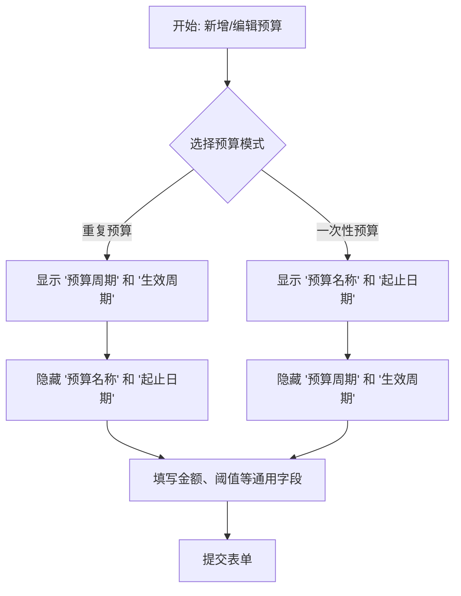

# 预算表单重构计划

## 1. 背景

当前的新增/编辑预算表单在逻辑上存在模糊和冲突，特别是“预算周期”和自定义“起止日期”的同时存在，导致用户体验不佳。此计划旨在重新设计表单，使其逻辑清晰、功能强大且易于使用。

## 2. 最终设计方案

### 2.1 预算模式选择 (Budget Mode)

- **控件**: 使用单选按钮组（Radio.Group）以获得更好的视觉清晰度。
- **选项**:
  - `重复预算` (Recurring) - 默认选中。适用于按月、季、年自动循环的预算。
  - `一次性预算` (One-time) - 适用于有明确起止日期的特定事件预算。

### 2.2 “重复预算”模式下的表单

当用户选择“重复预算”时，表单显示以下核心字段：

- **预算周期 (Period)**: 下拉框，选项为 `每月` / `每季` / `每年`。
- **生效周期 (Effective Cycle)**: (新增字段)
  - **目的**: 允许用户为未来设置预算。
  - **控件**: 根据“预算周期”动态变化。
    - 周期为“每月” -> 显示 **月份选择器 (MonthPicker)**。用户可选择 `2023-09`，预算即从9月1日开始。若留空，则默认为当前月。
    - 周期为“每季” -> 显示 **季度选择器 (QuarterPicker)**。
    - 周期为“每年” -> 显示 **年份选择器 (YearPicker)**。
- **隐藏字段**: `预算名称`, `开始日期`, `结束日期` 在此模式下隐藏。

### 2.3 “一次性预算”模式下的表单

当用户选择“一次性预算”时，表单显示以下核心字段：

- **预算名称 (Name)**: (新增字段) 文本输入框，选填。用于给一次性预算一个明确的标识（如：“国庆假期旅游”）。
- **开始日期 (Start Date)**: 日期选择器，**必填**。
- **结束日期 (End Date)**: 日期选择器，**必填**。
- **隐藏字段**: `预算周期`, `生效周期` 在此模式下隐藏。

## 3. UI 交互流程图 (Mermaid)

## 4. 组件修改范围

- **`frontend/src/BudgetManager.tsx`**:
  - 将 `Modal` 中的 `Form` 结构进行重构，引入 `Radio.Group` 来选择预算模式。
  - 根据选择的模式，使用条件渲染来动态显示/隐藏不同的表单项 (`Form.Item`)。
  - 引入新的日期选择控件（MonthPicker, QuarterPicker, YearPicker）。

- **`frontend/src/hooks/useBudgetForm.ts`**:
  - 可能需要调整 `handleSubmit` 函数，以处理两种模式下不同的表单数据结构。
  - 在 `openEditModal` 中，需要根据加载的预算数据，正确地设置表单的初始模式和其他字段值。

- **后端 API (`/api/budgets`)**:
  - 经过初步评估，后端可能 **无需修改**。
  - “重复预算”模式可以继续使用 `period` 字段，并通过 `生效周期` 计算出 `startDate` 和 `endDate` 发送给后端。
  - “一次性预算”模式直接使用用户输入的 `startDate` 和 `endDate`。
  - `预算名称` 可以复用现有的 `description` 字段或考虑新增字段（初步倾向于复用）。